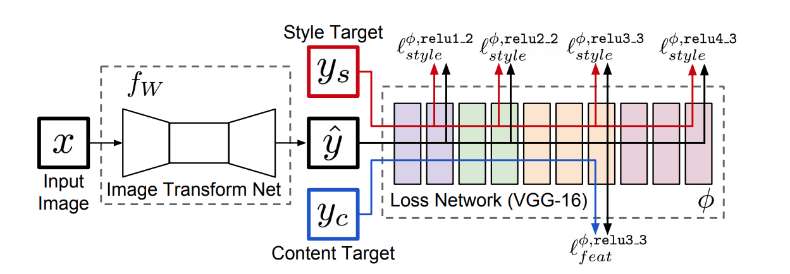
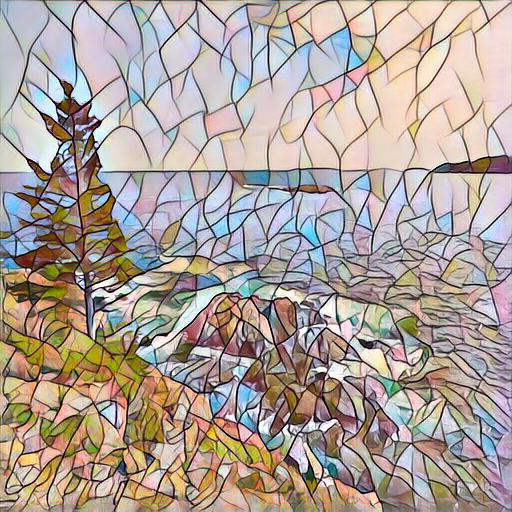

# Dashtoon_Style_Transfer

Implementation of the _Perceptual Losses Neural Style Transfer_ model in the paper:

> [Perceptual Losses for Real-Time Style Transfer and Super-Resolution](https://arxiv.org/abs/1603.08155) (ECCV 2016). 

## Model is trained on the COCO 2017 Validation dataset due to time limitations. Train on the full COCO 2017 train dataset to use it to its full potential.

Once the Image Transformation Network is trained on any style image using the COCO dataset, it can style any content image.

The hyperparameters such as Batch size, Epochs, Style Weight and Content Weight can be adjusted to give the best results.

## Instructions to run:
1. Open the 'Dashtoon_Assignment' file in a Google Colab Notebook.
2. Run every cell up to the downloading COCO dataset section.
3. If you want to train the model for a different style image, follow the instructions below. Otherwise, skip to step number 7 if you want to use a pre-trained model.
4. Download the COC0 dataset, and Colab will save it to your Google Drive.
5. Change to train_args accordingly to input the path of your style image.
6. Train the model. It may take some time.
7. In the Style transfer section, set the path of the model as well as the content image.
8. Run the Style Transfer function to style your image.

## Example

 # Style Image

# Content Image

# Output Image

Thank you
